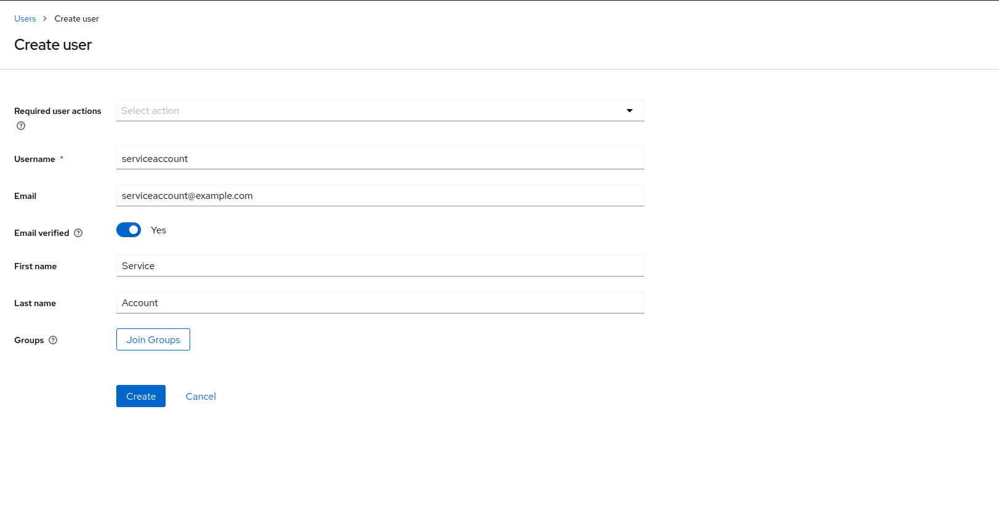
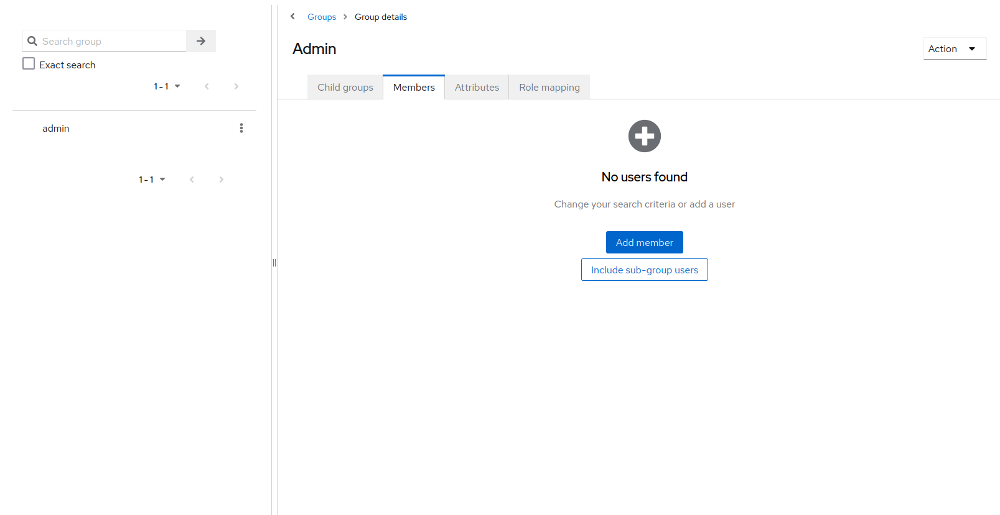

# Add attributes to profile scope

Add all required attributes to profile.
Client Scopes -> Profile -> Mappers -> Add Mapper -> By Configuration -> User-Attribute

Make sure management admin account for sync has `client consent` disabled.

## How to configure an environment
### Create a new Client

In this example this is done for a stage environment.

Make sure the `Client authentication` is enabled and saved.

Now a `Credentials` tab should show:

Fill in the `Client Secret` and realm name into the `.env` or `docker-compose.yaml`.
Enable `client consent` to show the user what the app reads.
Login Theme Should be Keywind

Now the login environment is configured. Now we need to configure the back channel user update.

## Importer
### Create a Service Account for Importer

Set a new Password.

Assign a new Role:

Assign `realm-management admin`

### Create a new Client for Importer

Make sure management admin account for sync has `client consent` disabled.
Enable `client authentication` and `authorization`

Assign `realm-management admin` within `service account roles` within the client for the importer.

Before using the importer make sure to configure the Email Settings for the realm.

## Add all User attributes set by importer to client scope

Go to Client Scope -> Profile

Mappers -> Add Mapper -> By Configuration

Create a new `User Attribute` mapper

This needs to look like

Repeat this for all attributes.
At time of writing these are:
- member_id
- mitgliedschaft
- managed_by
- birth_date
- clubboat
- boat

## Admin Permissions
Create a Admin group:

Add Members:

Create a Admin role:

Assign Role to Group

Add Members to group. After log out and log in the user should have the role in the client application.

## Membership Type, Groups and Admin matching
Membership Type is directly matched via name. Name from membership in Keycloak User == Name in Database.
For Group matching for reservations this is done via an internal name, which has to match the group name.
Members from the keycloak admin group will be superusers in clubapp.
For all groups managed, all attributes and membership types have a look at the importer.

## Invitation Link Duration
Per default an invitation link is 12h valid.
`Realm Settings -> Token -> Override Action Tokens`

## Configure Sync

The configuration of a service account for user sync is required to use keycloak client.
A `serviceaccount` needs to be created and a password is required.
This account needs the role `view-realm`.
